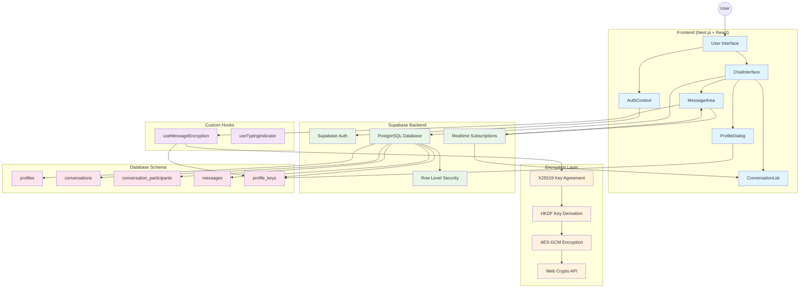
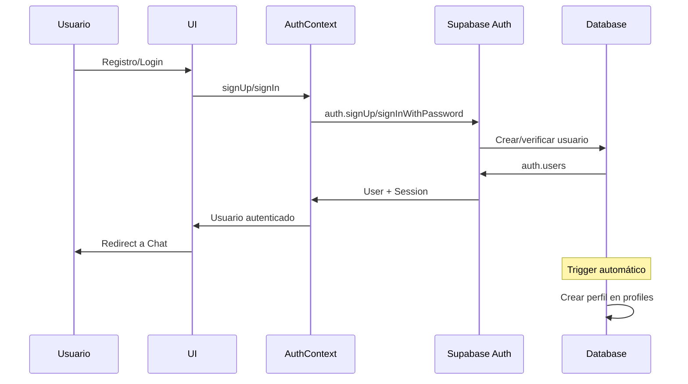
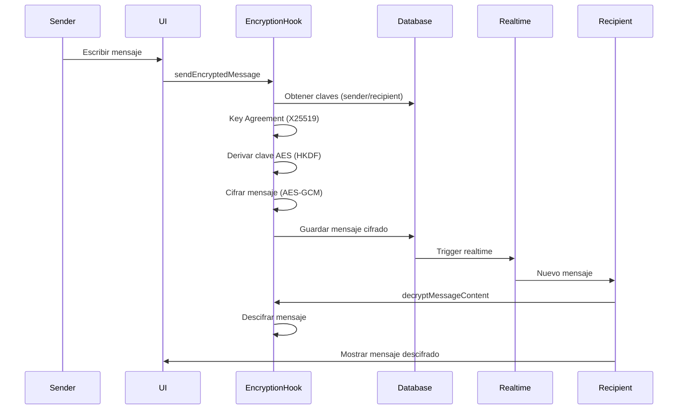

# Mensajería - Arquitectura de la Aplicación de Chat

## Resumen

**Mensajería** es una aplicación de chat en tiempo real inspirada en WhatsApp, construida con Next.js y Supabase. Implementa cifrado de extremo a extremo usando X25519 Diffie-Hellman key agreement y AES-GCM, con gestión de claves basada en DID (Decentralized Identifiers).

## Stack Tecnológico

- **Frontend**: Next.js 15, React 19, TypeScript
- **Styling**: Tailwind CSS
- **Backend**: Supabase (PostgreSQL + Realtime)
- **Autenticación**: Supabase Auth
- **Cifrado**: X25519 + AES-GCM con Web Crypto API
- **Gestión de Estado**: React Context + Custom Hooks
- **Iconos**: Lucide React
- **Fechas**: date-fns

## Esquema de Base de Datos

### Tablas Principales

```sql
-- Perfiles de usuario (extiende auth.users)
profiles {
  id: uuid (PK, FK to auth.users)
  username: text (unique)
  full_name: text
  avatar_url: text
  created_at: timestamp
  updated_at: timestamp
}

-- Conversaciones (privadas y grupales)
conversations {
  id: uuid (PK)
  name: text (nullable, para grupos)
  is_group: boolean
  created_by: uuid (FK to profiles)
  created_at: timestamp
  updated_at: timestamp
}

-- Participantes de conversaciones (muchos a muchos)
conversation_participants {
  id: uuid (PK)
  conversation_id: uuid (FK to conversations)
  user_id: uuid (FK to profiles)
  joined_at: timestamp
}

-- Mensajes (con soporte para cifrado)
messages {
  id: uuid (PK)
  conversation_id: uuid (FK to conversations)
  sender_id: uuid (FK to profiles)
  content: text (texto plano/fallback)
  encrypted_content: text (JSON con datos cifrados)
  sender_public_key: text (clave pública del remitente)
  recipient_public_key: text (clave pública del destinatario)
  encryption_algorithm: text (x25519-aes-gcm)
  message_type: text (text, encrypted_text)
  created_at: timestamp
  updated_at: timestamp
}

-- Claves criptográficas de usuarios (para DID)
profile_keys {
  id: uuid (PK)
  profile_id: uuid (FK to profiles)
  key_usage: text (keyAgreement, authentication)
  curve_type: text (x25519, ed25519)
  private_key: text (hex)
  public_key: text (hex)
  created_at: timestamp
}
```

### Políticas de Seguridad (RLS)

- **profiles**: Lectura pública, escritura solo del propio perfil
- **conversations**: Solo participantes pueden ver/crear
- **conversation_participants**: Solo participantes pueden ver/crear
- **messages**: Solo participantes de la conversación pueden ver/enviar
- **profile_keys**: Solo el propietario puede ver/gestionar

## Arquitectura de Componentes

### Estructura de Directorios

```
src/
├── app/                    # App Router de Next.js
│   ├── layout.tsx         # Layout principal
│   └── page.tsx           # Página principal (auth check)
├── components/
│   ├── auth/              # Componentes de autenticación
│   │   ├── AuthPage.tsx   # Página de auth con tabs
│   │   ├── LoginForm.tsx  # Formulario de login
│   │   └── SignUpForm.tsx # Formulario de registro
│   └── chat/              # Componentes de chat
│       ├── ChatInterface.tsx     # Interfaz principal
│       ├── ConversationList.tsx  # Lista de conversaciones
│       ├── MessageArea.tsx       # Área de mensajes
│       ├── UserProfile.tsx       # Perfil de usuario
│       ├── NewConversationModal.tsx # Modal nueva conversación
│       └── ProfileDialog.tsx     # Configuración DID/claves
├── contexts/
│   └── AuthContext.tsx    # Contexto de autenticación
├── hooks/
│   ├── useMessageEncryption.ts # Hook para cifrado
│   └── useTypingIndicator.ts   # Hook para indicador de escritura
├── lib/
│   ├── supabase.ts        # Cliente de Supabase
│   ├── encryption.ts      # Utilidades de cifrado
│   └── database.types.ts  # Tipos de base de datos
└── types/
    └── chat.ts           # Tipos de la aplicación
```

### Componentes Principales

1. **ChatInterface**: Componente principal que orquesta toda la aplicación de chat
2. **ConversationList**: Lista de conversaciones con información de participantes
3. **MessageArea**: Área de visualización y envío de mensajes
4. **AuthPage**: Manejo de autenticación con login/registro
5. **ProfileDialog**: Configuración de claves DID y perfil

## Sistema de Cifrado

### Flujo de Cifrado de Mensajes

1. **Generación de Claves**: Cada usuario genera un par de claves X25519
2. **Key Agreement**: Se realiza Diffie-Hellman entre las claves de remitente y destinatario
3. **Derivación de Clave**: Se deriva una clave AES usando HKDF del secreto compartido
4. **Cifrado**: El mensaje se cifra con AES-GCM
5. **Almacenamiento**: Se guarda el contenido cifrado junto con metadatos

### Estructura de Mensaje Cifrado

```typescript
interface EncryptedMessageData {
  encryptedContent: string  // Contenido cifrado (base64)
  iv: string               // Vector de inicialización
  tag: string              // Tag de autenticación GCM
}
```

## Flujo de Datos en Tiempo Real

### Subscripciones de Supabase

1. **Mensajes**: Suscripción a eventos INSERT en tabla `messages` por conversación
2. **Actualización Automática**: Los nuevos mensajes se descifran y añaden al estado
3. **Indicadores de Escritura**: Sistema de typing indicators en tiempo real

### Estados de la Aplicación

- **AuthContext**: Usuario autenticado, sesión, funciones de auth
- **ChatInterface**: Conversaciones, mensajes, perfiles, estado de UI
- **Encryption Hooks**: Estado de cifrado/descifrado, gestión de claves

## Diagrama de Arquitetura



## Flujo de Autenticación



## Flujo de Mensajería Cifrada



## Patrones de Seguridad

### 1. Cifrado de Extremo a Extremo
- Claves privadas nunca salen del dispositivo del usuario
- Cada mensaje usa un IV único
- Verificación de integridad con GCM tags

### 2. Row Level Security
- Políticas SQL que restringen acceso a datos por usuario
- Verificación automática en cada consulta
- Separación de datos por participación en conversaciones

### 3. Gestión de Claves
- Claves X25519 para key agreement
- Almacenamiento seguro en tabla `profile_keys`
- Rotación de claves soportada

### 4. Validación de Datos
- TypeScript para type safety
- Validación en frontend y backend
- Sanitización de inputs

## Consideraciones de Rendimiento

### 1. Optimizaciones de Base de Datos
- Índices en columnas frecuentemente consultadas
- Paginación de mensajes históricos
- Cleanup automático de mensajes antiguos

### 2. Optimizaciones de Frontend
- Lazy loading de conversaciones
- Virtualización de listas largas
- Debouncing en typing indicators

### 3. Optimizaciones de Cifrado
- Cache de claves derivadas
- Cifrado asíncrono para no bloquear UI
- Web Workers para operaciones pesadas (futuro)

## Deployment y Configuración

### Variables de Entorno
```env
NEXT_PUBLIC_SUPABASE_URL=http://localhost:54321
NEXT_PUBLIC_SUPABASE_ANON_KEY=your_anon_key_here
```

### Scripts de Configuración
- `setup-local-supabase.sh`: Inicialización de Supabase local
- `database-schema.sql`: Esquema completo de base de datos
- `migrations/`: Migraciones incrementales

### Comandos Disponibles
```bash
npm run dev          # Desarrollo
npm run build        # Construcción
npm run start        # Producción
npm run setup        # Configurar Supabase local
```

## Roadmap y Mejoras Futuras

### Funcionalidades Planeadas
1. **Llamadas de voz/video**: WebRTC integration
2. **Compartir archivos**: Upload de archivos cifrados
3. **Estados de mensaje**: Entregado, leído, etc.
4. **Modo offline**: Service Workers + IndexedDB
5. **Notificaciones push**: PWA notifications

### Mejoras de Seguridad
1. **Perfect Forward Secrecy**: Rotación automática de claves
2. **Verificación de identidad**: QR codes para verificar claves
3. **Auditoría de seguridad**: Logs de eventos críticos
4. **Backup de claves**: Backup cifrado de claves privadas

### Optimizaciones
1. **CDN**: Distribución de assets estáticos
2. **Caching**: Redis para cache de sesiones
3. **Scaling**: Horizontal scaling de Supabase
4. **Monitoring**: Métricas de rendimiento y errores

---

Esta arquitectura proporciona una base sólida para una aplicación de chat segura y escalable, con cifrado de extremo a extremo y experiencia de usuario moderna similar a WhatsApp.